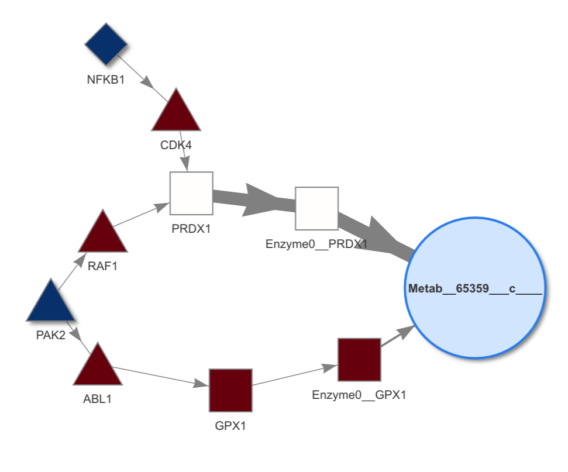
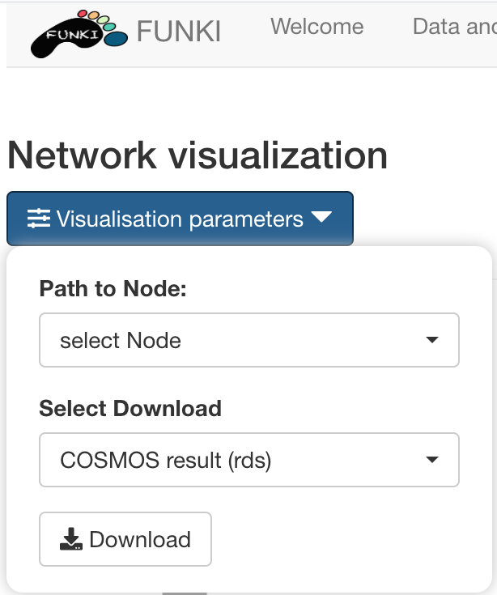

# Cosmos analysis report

## Overview

COSMOS (Causal Oriented Search of Multi-Omic Space) is a method that integrates phosphoproteomics, transcriptomics, and metabolomics data sets. COSMOS leverages extensive prior knowledge of signaling pathways, metabolic networks, and gene regulation  with computational methods to estimate activities of transcription factors and kinases as well as network-level causal reasoning. This pipeline can provide mechanistic explanations for experimental observations across multiple omic data sets. 

COSMOS uses [CARNIVAL](https://saezlab.github.io/CARNIVAL/)’s Integer Linear Programming (ILP) optimization strategy to find the smallest coherent subnetwork causally connecting as many deregulated TFs, kinases/phosphatases and metabolites as possible. The subnetwork is extracted from a novel integrated PKN (available [here](http://metapkn.omnipathdb.org/)) spanning signaling, transcriptional regulation and metabolism.  Transcription factors activities are inferred from gene expression with [DoRothEA](https://saezlab.github.io/dorothea/), a meta resource of TF/target links. Kinase activities are inferred from phosphoproteomic with a kinase/substrate network of [Omnipath](http://omnipathdb.org/), a meta resource of protein-protein. [CARNIVAL](https://saezlab.github.io/CARNIVAL/) was adapted to find mechanistic hypotheses connecting the TF and kinase activities with metabolites from a signaling/metabolic prior knowledge network combining [Omnipath](http://omnipathdb.org/), [STITCHdb](http://stitch.embl.de/) and [Recon3D](https://www.vmh.life/). 

## The analysis

* layer_1: the upstream regulators
* layer_2: the downstream regulated nodes 
* RNA_data: the differential expression anaylsis results, that is the stats (such as t-values) of all the tested genes.
* PKN: The prior knowledge network that will be used by COSMOS to connect the nodes of layer_1 with layer_2.

* solver: cplex
* solver_path: path to the cplex solver executable provided by user

      cosmos <- run_COSMOS(layer_1 = layer_1, 
                         layer_2 = layer_2, 
                         RNA_data = data, 
                         PKN = PKN, 
                         solver = input$solver_cosmos, 
                         solver_path = solverpath_cosmos,
                         runtime = c(200,1000,200,1000))
                       

## The results

The cosmos run yields a network of coherent mechanistic hypotheses that connects the nodes of layer_1 with the nodes of layer_2.

The node shapes represent the type of molecular entities that are connected together (e.g. kinase, transcription factors and metabolites), while the edge arrow shape represent activation or inhibitions. The network can be centered on a given node to focus on specific parts of the cosmos network, using the drop down list of the visualisation parameters button.

