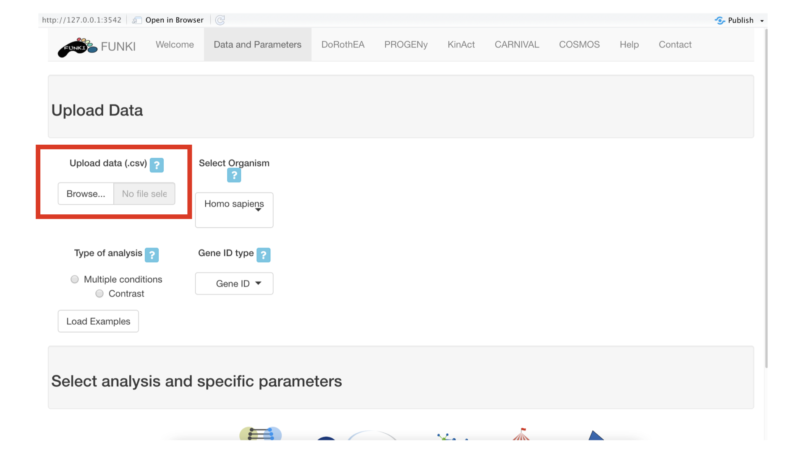
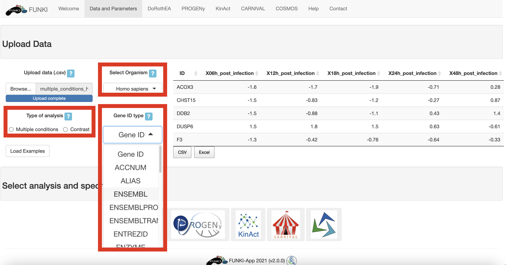

## Tutorial: DoRothEA

This tutorial is designed to guide users through the use of DoRothEA in FUNKI.

The first step is to upload your data, either the output of differential gene expression analysis or multiple conditions.
See [transcriptutorial](https://github.com/saezlab/transcriptutorial) for more information on how to run a differential gene expression analysis using the _limma package_.

Once the RNA data has been properly uploaded, the table is displayed on the right.
The table content is downloadble in _csv_ or _excel_ format.
This maybe of particular interest for the user to prepare the input dataset.

Either for hte multiple condition file, or for the differential gene expression, an _ID_ column must be provided.
This holds the information about the gene identifier.
For the multiple condition file, the rest of the columns will be treated as different conditions.
and for the differential expression file, at least a column named _statistic_ must be provided.
This statistic column could be t-values, logFc, z-scores or even p-values.

Remember to indicate the **type of analysis**.

It is also mandatory to indicate the **species**, and the **type of identifier** used of the genes.
The user can use the drop down list of the gene identifiers to indicate the ids of the file.
We warmly recommend _HGNC_ symbols.

Next, go at the bottom of the window and click on the DoRothEA logo to display the specific parameters.

* Select confidence level: The confidence assignment comprises 5 levels, ranging from A (highest) to E (lowest).
* Regulon's minimal size: Minimum number of genes targeted by a transcription factor.
* Method for computing signatures: Method for computing the single sample signatures.

Once everything is set and ready, 
you can press the "Run DoRothEA" button, 
which should take you to the results tab.

In the results tab, you can use the control widgets to browse around the results.

* **Number of Transcription Factors to display:** Show the top *n* activated and inhibited TFs (Default: 25).
* **Number of targets to display:** Show the top *n* targets of a selected TF (Default: 5) 
* **Select Sample/Contrast:** Select contrast/sample of interest.
* **Select Transcription Factor:** Select TF of interest. (Default: TF with the highest activity).

To download the result, the user can either download each of the figues and the analysis by selecting the **type of download** and then click on the download button.
The user can also download an integrated report with all the parameters, code and results of the analysis by clicking on **Generate report**.

 

