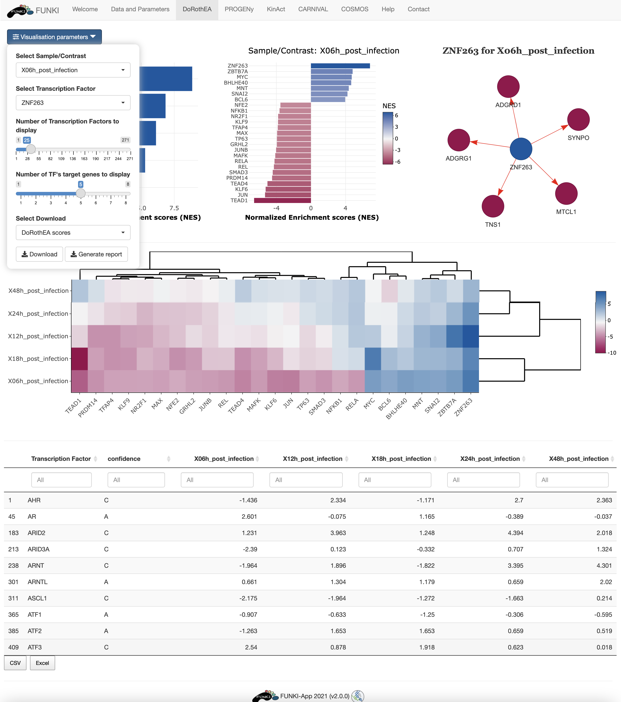

## Tutorial: DoRothEA

This tutorial is designed to guide users through the use of DoRothEA in FUNKI.

The first step is to upload your data, either a contrast experiment or multiple conditons.
See [transcriptutorial](https://github.com/saezlab/transcriptutorial) for more info on how to obtain normalized counts of differential analysis top table output (e.i. _limma_).

Once the RNA data has been properly uploaded, the table is displayed on the right.

When it is a multiple conditions file, 
the ID column should include the gene ids for each of the samples (rest of the columns).
If the file is a contrast experiment, 
it would contain at least the ID column and a column named "t" (for t-value), as a csv file.
Remember to indicate the **type of analysis**.

It is also mandatory to indicate the **species**, and the **type of identifier** used of the genes.
The user can use the drop down list of the gene identifiers to indicate the ids of the file.
We warmly recommend _HGNC_ symbols.

Next, go at the bottom of the window and click on the DoRothEA logo to display the specific parameters.

* Select confidence level: The confidence assigment comprises 5 levels, ranging from A (highest) to E (lowest).
* Regulon's minimal size: Minimun number of genes targeted by a kinase.
* Method for computing signatures: Method for computing the single sample signatures.

Once everything is set and ready, 
you can press the "Run DoRothEA" button, 
which should take you to the results tab.

In the results tab, you can use the control widgets to browser around the results.

* **Number of Transcription Factors to display:** Show the top *n* activated and inhibited TFs (Default: 25).
* **Number of targets to display:** Show the top *n* targets of a selected TF (Default: 5) 
* **Select Sample/Contrast:** Select contrast/sample of interest.
* **Select Transcription Factor:** Select TF of interest. (Default: TF with the highest activity).

To download the result, the user can either download each of the figues and the analysis by selecting the **type of download** and then click on the download button.
The user can also download an integrated report with all the parameters, code and results of the analysis by clicking on **Generate report**.

 

