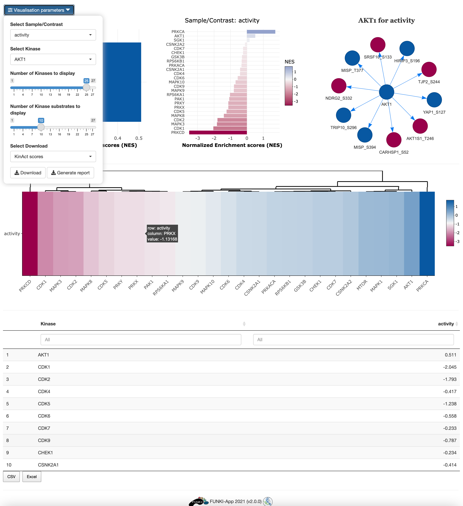

## Tutorial: KinAct

This tutorial is designed to guide users through the use of KinAct in FUNKI.

The first step is to upload the phospho data.

Once the phospho data has been properly uploaded, the table is displayed on the right.

The table should contain as row names the HGNC symbol of the kinase and the phosphorilation site, 
formating such as: <kinase>_<phosphosite>.

Kinact is only available for Human, so the organism is not required. 

Next, go at the bottom of the window and click on the KinAct logo to display the specific parameters.

* Regulon's minimal size: Minimun number of genes targeted by a kinase.
* Method for computing signatures: Method for computing the single sample signatures.

Once everything is set and ready, 
you can press the "Run KinAct" button, which should take you to the results tab.

In the results tab, you can use the control widgets to browser around the results.

* **Number of Kinases to display:** Show the top *n* activated and inhibited Kinases (Default: 25).
* **Number of phosphosites to display:** Show the top *n* phosphosites of a selected kinase (Default: 5) 
* **Select Sample/Contrast:** Select contrast/sample of interest.
* **Select Kinase:** Select Kinase of interest. (Default: Kinase with the highest activity).

To download the result, the user can either download each of the figues and the analysis by selecting the **type of download** and then click on the download button.
The user can also download an integrated report with all the parameters, code and results of the analysis by clicking on **Generate report**.

 

