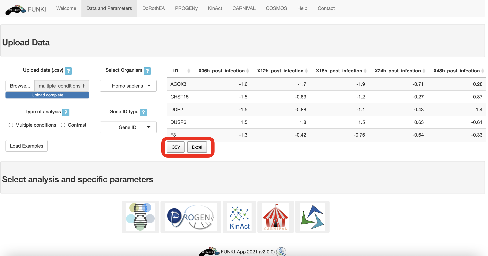
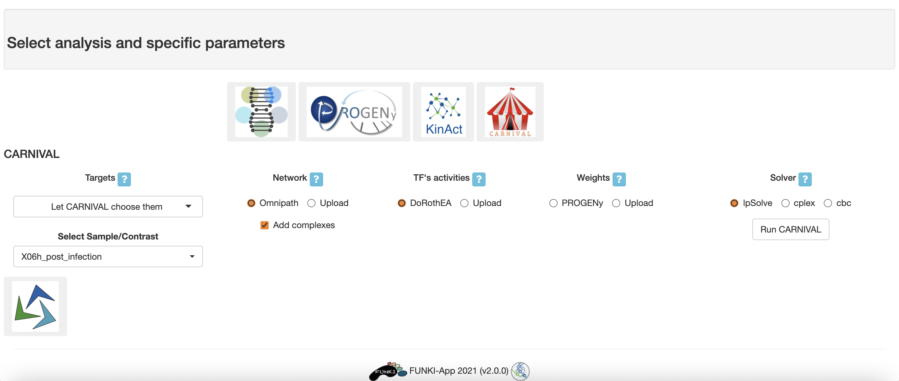

## Tutorial: CARNIVAL

This tutorial is designed to guide users through the use of CARNIVAL in FUNKI.

The first step is to upload your data, either a contrast experiment or multiple conditons.
See [transcriptutorial](https://github.com/saezlab/transcriptutorial) for more info on how to obtain normalized counts of differential analysis top table output (e.i. _limma_).

Once the RNA data has been properly uploaded, the table is displayed on the right.

When it is a multiple conditions file, 
the ID column should include the gene ids for each of the samples (rest of the columns).
If the file is a contrast experiment, 
it would contain at least the ID column and a column named "t" (for t-value), as a csv file.
Remember to indicate the **type of analysis**.

It is also mandatory to indicate the **species**, and the **type of identifier** used of the genes.
The user can use the drop down list of the gene identifiers to indicate the ids of the file.
We warmly recommend _HGNC_ symbols.

Next, go at the bottom of the window and click on the CARNIVAL logo to display the specific parameters.

* Targets: If a list of targets is provided (My own list of targets), a comma-separated-value with HGNC symbols ids is required. The option: all from given network, will take all the most distant nodes of the provided network. The option: Let CARNIVAL choose them, runs inverseCARNIVAL, where the most suitable distant nodes will be selected automatically 
* Select sample/contrast: 
* Network: Generate a signed and directed network using Omnipath. If a network is upload, a tab-separated file with three headers (Source, Interaction, Target) is required. The network is based on genes, when it contains HGNC symbols, or proteins, when it contains uniprot ids.
* TF's activities: Calculate DoRothEA normalised enrichment scores based on the above selected parameters. Alternatively, a file with comma-separeted activites is requiered.
* Weights: Calculate PROGENy scores based on the above selected parameters. Alternatively, a file with comma-separeted scores (ranged between -1 and 1) per gene is requiered.
* Solver: Select solver to run the optimization. When cbc/cplex is selected, a path to the executable file is requiered.

The network, the targets, and the TF's activities are required.
The weights are optional.

When we are working with large problems, we advise to use cplex or cbc (only available locally).
How to obtain these softwares are found [here](https://saezlab.github.io/CARNIVAL/).

Once everything is set and ready, 
you can press the "Run CARNIVAL" button, 
which should take you to the results tab.

Optimizing the network can be a long operation, 
so you may need to wait a bit (up to 20 or 40 minutes). 
If you run FUNKI locally, you can also follow the progress of the optimisation in the R console.

In the results tab, you can use the control widgets to browser the network.

* **Focus on node:** Select a node to zoom in.
* **Hierarchical layout:** Get a hierarchical layout.

The CARNIVAL results can be forther analysed in a pathway/set enrichment analysis.

The user can get adventage of the resources from OmiPath or can upload a custom file.
By clicking in the OmniPath, a menu with all the resources can be browsed.
Loading the resources could take a while (a couple of minutes).

Once the resource is selected,
you can press the "Run" button.
Below, the resulst will be shown.

In the results tab, you can use the control widgets to browser the enrichment analysis.

* **Select resource:** Select resource to extract the biological groups. A custom file can be upload or use any of the resources available through Omnipath.
* **Adjusted pValue:** Adjusted pValue to use as threshold to show the enriched results.
* **Paths/Signatures:** The number of significant Paths/Signatures to show in plots.
* **Genes:** The number of significant Genes to show in volcano plot.

Finally, to download the result, the user can either download each of the figues and the analysis by selecting the **type of download** and then click on the download button.
The user can also download an integrated report with all the parameters, code and results of the analysis by clicking on **Generate report**.

